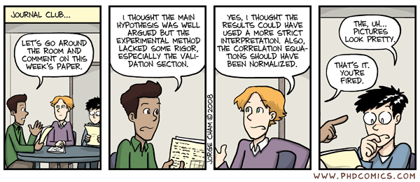

class: middle, center, title-slide

# Advanced Machine Learning

Course syllabus, Spring 2020

  
Prof. Gilles Louppe 
[g.louppe@uliege.be](g.louppe@uliege.be)  

Prof. Louis Wehenkel 
[l.wehenkel@uliege.be](l.wehenkel@uliege.be)

???

https://www.cs.toronto.edu/~duvenaud/courses/csc2541/index.html projects

---

class: middle, center

.italic[To know, read; to learn, write; to master, teach.]

(Hindu proverb)

---

# Logistics

This course is given by:
- Prof. Gilles Louppe ([g.louppe@uliege.be](mailto:g.louppe@uliege.be))
- Prof. Louis Wehenkel ([l.wehenkel@uliege.be](l.wehenkel@uliege.be))
- (Prof. Pierre Geurts ([p.geurts@uliege.be](p.geurts@uliege.be)))
- Researchers from the department
- ... and you!

 

.center[
.circle[] &nbsp;
.circle[] &nbsp;
.circle[] &nbsp;
]

---

# Lectures

- This course is organized as a **journal club**.
- Reading and presentation of recent machine learning research papers.
- Every week, one of us will:
    - select a research paper,
    - introduce the necessary background,
    - present the paper,
    - discuss and criticize its content.
    - selected people will challenge the paper.
- Goal: training for research and development in machine learning.

---

class: middle

.center.width-100[]

.footnote[Credits: Jorge Cham, [PHD Comics](http://phdcomics.com/comics/archive.php?comicid=963).]

---

# Materials

Papers and slides are available at [github.com/glouppe/info8004-advanced-machine-learning](https://github.com/glouppe/info8004-advanced-machine-learning).
- In HTML and in PDFs.
- Slides posted online the day before the lesson (hopefully).
- Papers announced ~1 week before the lectures.

---

# Outline

Check the Github page!

---

# Reading and presentation assignment

- Read a selected machine learning paper.
- Prepare a 30-minute lecture, covering the necessary background and discussing the paper.
- Short summary report.

More details to be announced later.

---

# Evaluation

- Exam (60%)
- Reading and presentation assignment (40%)

---

class: end-slide, center
count: false

Let's start!
