class: middle, center, title-slide
count: false

# Advanced Machine Learning

.bold[Paper]: Cranmer, Brehmer, and Louppe, .italic[The frontier of  simulation-based inference], 2020.

  

Gilles Louppe 
[g.louppe@uliege.be](mailto:g.louppe@uliege.be)

---

count: false
class: middle, center

This talk is inspired and adapted from previous talks given by my wonderful co-authors *Kyle Cranmer* and *Johann Brehmer*. Thanks to them!

 
.center[
.circle.width-25[]
.circle.width-25[]
]

---

class: middle

.center.width-100[]

---

# Simulation-based inference

 
.center.width-100[]

---

class: middle

.center.width-70[]

.center[$$\theta, z, x \sim p(\theta, z, x)$$]

---

class: middle
count: false

.center.width-70[]

.center[$$\theta, z \sim p(\theta, z | x)$$]

---

class: middle, black-slide

.center[<video controls autoplay loop muted preload="auto" height="480" width="640">
  <source src="./figures/galton.mp4" type="video/mp4">
</video>]

---

class: middle

The Bean machine is a **metaphore** of *simulation-based science*:
.grid.center[
.kol-2-5[Bean machine]
.kol-1-5[$\to$]
.kol-2-5[Computer simulation]
]
.grid.center[
.kol-2-5[Parameters $\theta$]
.kol-1-5[$\to$]
.kol-2-5[Model parameters $\theta$]
]
.grid.center[
.kol-2-5[Buckets $x$]
.kol-1-5[$\to$]
.kol-2-5[Observables $x$]
]
.grid.center[
.kol-2-5[Random paths $z$]
.kol-1-5[$\to$]
.kol-2-5[Latent variables $z$  (stochastic execution traces through simulator)]
]

---

class: middle
count: false

# The case of particle physics

---

class: center, middle, black-slide

.width-70[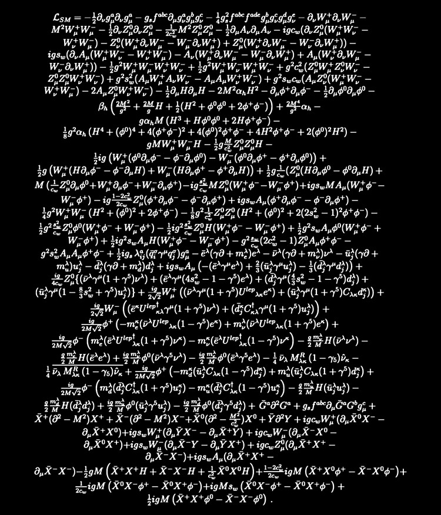]

---

background-image: url(./figures/lhc.gif)
class: center, middle, black-slide

---

background-image: url(./figures/englert.jpg)
class: center, middle, black-slide

---

class: middle

.center.width-90[]
.grid[
.kol-1-5.center[
SM with parameters $\theta$

.width-100[]]
.kol-2-5.center[
Simulated observables $x$

.width-80[]]
.kol-2-5.center[
Real observations $x\_\text{obs}$

.width-80[]
.width-80[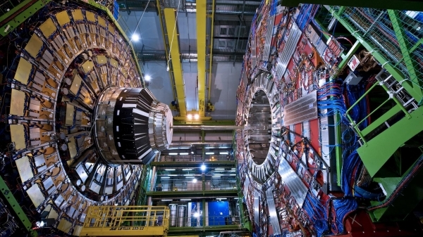]]
]

---

class: middle

.width-100[]

???

generation: pencil and paper calculable from first principles

---

count: false
class: middle

.width-100[]

???

parton shower + hadronization: controlled approximation of first principles + phenomenological model

---

count: false
class: middle

.width-100[]

???

detector simulation: interaction with the materials and digitization

---

count: false
class: middle

.width-100[]

???

reconstruction simulation

---

class: middle

$$p(x|\theta) = \underbrace{\iiint}\_{\text{yikes!}} p(z\_p|\theta) p(z\_s|z\_p) p(z\_d|z\_s) p(x|z\_d) dz\_p dz\_s dz\_d$$

???

That's bad!

---

class: middle
count: false

# Inference 

---

# Problem statement(s)

Start with
- a simulator that lets you generate $N$ samples $x\_i \sim p(x\_i|\theta\_i)$ (for parameters $\theta\_i$ of our choice),
- observed data $x\_\text{obs} \sim p(x\_\text{obs} | \theta\_\text{true})$,
- a prior $p(\theta)$.

Then,
.grid[
.kol-1-3.center[a) estimate $\theta\\\_\text{true}$  (e.g., MLE)]
.kol-1-3.center[b) construct confidence sets]
.kol-1-3.center[c) estimate the posterior $p(\theta|x\_\text{obs})$ (or sample from it)]
]

.center.width-90[]

---

class: middle

## Ingredients

Statistical inference requires the computation of *key ingredients*, such as
- the likelihood $p(x|\theta)$,
- the likelihood ratio $r(x|\theta\_0,\theta\_1) = \frac{p(x|\theta\_0)}{p(x|\theta\_1)}$,
- or the posterior $p(\theta|x)$,
 
but none are usually tractable in simulation-based science!

---

# Inference algorithms

 
.center.width-100[]

---

count: false

# Inference algorithms

 
.center.width-100[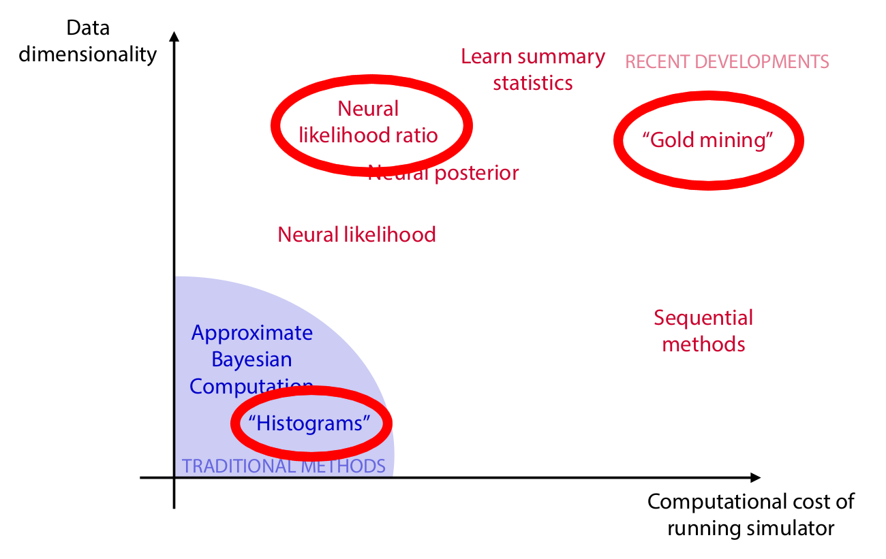]

---

class: middle
count: false

# The frequentist approach

---

# The frequentist (physicist's) way

.grid[
.kol-3-4[
The Neyman-Pearson lemma states that the likelihood ratio
$$r(x|\theta\_0,\theta\_1) = \frac{p(x|\theta\_0)}{p(x|\theta\_1)}$$
is the **most powerful test statistic** to discriminate between a null hypothesis $\theta\_0$ and an alternative $\theta\_1$.
]
.kol-1-4[ .width-100[]]
]

.center.width-70[]

???

- The first, most obvious example that illustrates the importance of the likelihood ratio is the Neyman-Pearson lemma, which ...

- The LR test assesses the goodness of fit of two competing hypothesis. It applies to simple and composite hypotheses.

- ... but how do you compute this ratio in the likelihood-free scenario?

---

class: middle

.center.width-90[]

Define a projection function $s:\mathcal{X} \to \mathbb{R}$ mapping observables $x$ to a summary statistic $x'=s(x)$.

Then, **approximate** the likelihood $p(x|\theta)$ with the surrogate $\hat{p}(x|\theta) = p(x'|\theta)$.

From this it comes
$$\frac{p(x|\theta\_0)}{p(x|\theta\_1)} \approx \frac{\hat{p}(x|\theta\_0)}{\hat{p}(x|\theta\_1)} = \hat{r}(x|\theta\_0,\theta\_1).$$

---

class: middle

## Wilks theorem

Consider the test statistic $$q(\theta) = -2 \sum\_x \log \frac{p(x|\theta)}{p(x|\hat{\theta})} = -2 \sum\_x \log r(x|\theta,\hat{\theta})$$ for a fixed number $N$ of observations $\\{x\\}$ and where $\hat{\theta}$ is the maximum likelihood estimator.

When $N \to \infty$, $q(\theta) \sim \chi\_2$.

Therefore (and provided the assumptions apply!), an observed value $q\_\text{obs}(\theta)$ translates directly to a p-value that measures the confidence with which $\theta$ can be excluded.

---

class: middle, center

.grid[
.kol-2-3[.width-100[]]
.kol-1-3[ .width-100[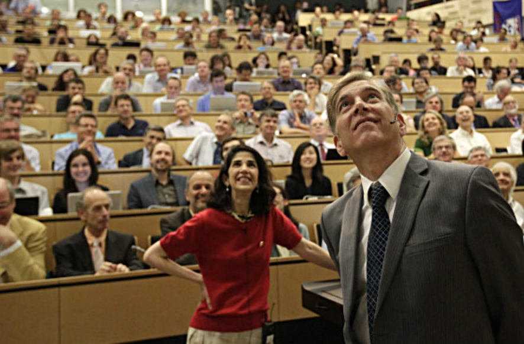]

.width-100[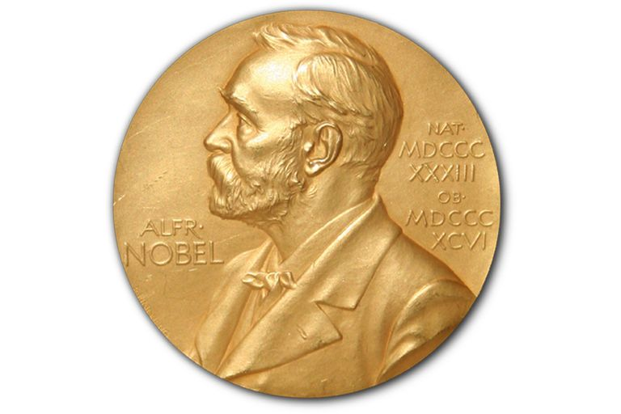]]
]

Discovery of the Higgs boson at 5-$\sigma$

???

m4l = four-lepton invariant mass

Q: How to choose $s$?

---

# The likelihood ratio trick

    
.center.width-100[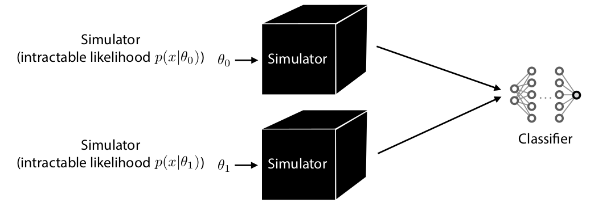]

---

class: middle

The solution $\hat{s}$ found after training  approximates the optimal classifier
$$\hat{s}(x) \approx s^\*(x) = \frac{p(x|\theta\_1)}{p(x|\theta\_0)+p(x|\theta\_1)}.$$
Therefore, $$r(x|\theta\_0,\theta\_1) \approx \hat{r}(x|\theta\_0,\theta\_1)=\frac{1-\hat{s}(x)}{\hat{s}(x)}.$$

---

class: middle

To avoid retraining a classifier $\hat{s}$ for every $(\theta\_0, \theta\_1)$ pair, fix $\theta\_1$ to $\theta\_\text{ref}$ and train a single **parameterized** classifier $\hat{s}(x|\theta\_0,\theta\_\text{ref})$ where $\theta\_0$ is also given as input.

Therefore, we have
$$\hat{r}(x|\theta\_0,\theta\_\text{ref}) = \frac{1 - \hat{s}(x|\theta\_0,\theta\_\text{ref})}{\hat{s}(x|\theta\_0,\theta\_\text{ref})}$$
such that for any $(\theta\_0, \theta\_1)$,
$$r(x|\theta\_0,\theta\_1) \approx \frac{\hat{r}(x|\theta\_0,\theta\_\text{ref})}{\hat{r}(x|\theta\_1,\theta\_\text{ref})}.$$

---

class: middle

## Inference

.center.width-100[]

---

# Gold mining

.center.width-40[]

We cannot compute $p(x|\theta) = \int p(x,z|\theta) \text{d}z$.

However, using techniques from probabilistic programming we can often extract
- the joint likelihood ratio $r(x,z|\theta) = \frac{p(x,z|\theta)}{p\_\text{ref}(x,z)}$
- the joint score $t(x,z|\theta) = \nabla\_\theta \log p(x,z|\theta)$.

---

class: middle

This is interesting because
- the joint likelihood ratio is an unbiased estimator of the likelihood ratio,
- the joint score provides unbiased gradient information

$\Rightarrow$ use them as labels in supervised NN training!

.center.width-100[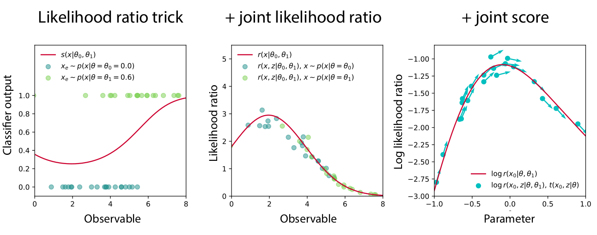]

---

class: middle

## RASCAL

.center.width-100[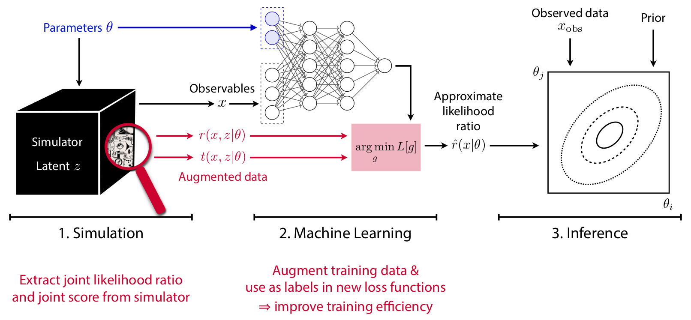]

---

class: middle
count: false

# The Bayesian way

---

# Approximate Bayesian Computation (ABC)

.center.width-100[]

## Issues

- How to choose $x'$? $\epsilon$? $||\cdot||$?
- No tractable posterior.
- Need to run new simulations for new data or new prior.

.footnote[Credits: Johann Brehmer.]

---

# Amortizing Bayes

The Bayes rule can be rewritten as
$$p(\theta|x) = \frac{p(x|\theta) p(\theta)}{p(x)} = r(x|\theta) p(\theta) \approx \hat{r}(x|\theta)p(\theta),$$
where $r(x|\theta) = \frac{p(x|\theta)}{p(x)}$ is the likelihood-to-evidence ratio.

As previously, the ratio can be learned with the likelihood ratio trick!

---

class: middle

.grid[
.kol-1-3.center[

 

$x,\theta \sim p(x,\theta)$

     

$x,\theta \sim p(x)p(\theta)$

]
.kol-2-3[.center.width-80[]]
]

---

class: middle

The solution $d$ found after training  approximates the optimal classifier
$$d(x, \theta) \approx d^\*(x, \theta) = \frac{p(x, \theta)}{p(x, \theta)+p(x)p(\theta)}.$$
Therefore, $$r(x|\theta) = \frac{p(x|\theta)}{p(x)} = \frac{p(x, \theta)}{p(x)p(\theta)} \approx \frac{d(x, \theta)}{1-d(x, \theta)} = \hat{r}(x|\theta).$$

---

class: middle

## Likelihood-free MCMC

MCMC samplers require the evaluation of the posterior ratios, which can be obtained by evaluating the ratio of ratios:
$$
\begin{aligned}
\frac{p(\theta\_\text{new}|x)}{p(\theta\_{t-1}|x)} &= \frac{p(x|\theta\_\text{new}) p(\theta\_\text{new}) / p(x)}{p(x|\theta\_{t-1}) p(\theta\_{t-1}) / p(x)} \\\\
&= \frac{r(x|\theta\_\text{new})}{r(x|\theta\_{t-1})} \frac{p(\theta\_\text{new})}{p(\theta\_{t-1})}.
\end{aligned}$$

Extensions with HMC is possible since $\nabla\_\theta p(x|\theta) = \frac{\nabla\_\theta r(x|\theta)}{r(x|\theta)}$.

.center.width-60[]

.footnote[Image credits: [Chuck Huber](https://blog.stata.com/2016/11/15/introduction-to-bayesian-statistics-part-2-mcmc-and-the-metropolis-hastings-algorithm/), 2016.]

---

# Diagnostics

.grid[
.kol-2-3[.center.width-100[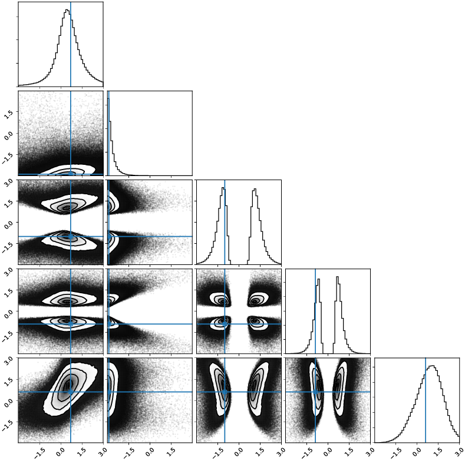]]
.kol-1-3.italic[

How to assess that the approximate posterior is not wrong?

]
]

---

class: middle

## Coverage

- For every $x,\theta \sim p(x,\theta)$ in a validation set, compute the $1-\alpha$ credible interval based on $\hat{p}(\theta|x) = \hat{r}(x|\theta)p(\theta)$.
- The fraction of samples for which $\theta$ is contained within the interval corresponds to the empirical coverage probability.
- If the empirical coverage is larger that the nominal coverage probability $1-\alpha$, then the ratio estimator $\hat{r}$ passes the diagnostic.

---

class: middle

## Convergence towards the nominal value $\theta^*$

If the approximation $\hat{r}$ is correct, then the posterior 
$$
\begin{aligned}
\hat{p}(\theta|\mathcal{X}) = \frac{p(\theta) p(\mathcal{X} | \theta)}{p(\mathcal{X})} &= p(\theta) \left[ \int p(\theta') \prod\_{x \in \mathcal{X}} \frac{p(x|\theta')}{p(x|\theta)} d\theta' \right]^{-1} \\\\
&\approx p(\theta) \left[ \int p(\theta') \prod\_{x \in \mathcal{X}} \frac{\hat{r}(x|\theta')}{\hat{r}(x|\theta)} d\theta' \right]^{-1}
\end{aligned}
$$ 
should concentrate around $\theta^\*$ as the number of observations
$$\mathcal{X} = \\{ x\_1, ..., x\_n \\},$$
for $x\_i \sim p(x|\theta^\*)$, increases.

---

class: middle

## ROC AUC score

The ratio estimator $\hat{r}(x|\theta)$ is only exact when samples $x$ from the reweighted marginal model $p(x)\hat{r}(x|\theta)$ cannot be distinguished from samples $x$ from a specific likelihood $p(x|\theta)$.

Therefore, the predictive ROC AUC performance of a classifier should be close to $0.5$ if the ratio is correct.

---

class: middle
count: false

# Showtime!

---

class: middle, center, black-slide

.center.width-100[]

 

## Case 1: Hunting new physics at particle colliders

---

class: middle

.center.width-100[]

With enough training data, the ML algorithms get the likelihood function right.

Using more information from the simulator improves sample efficiency substantially.

???

baseline: 2d histogram analysis of jet momenta and angular correlations

---

class: center, middle, black-slide

.center.width-80[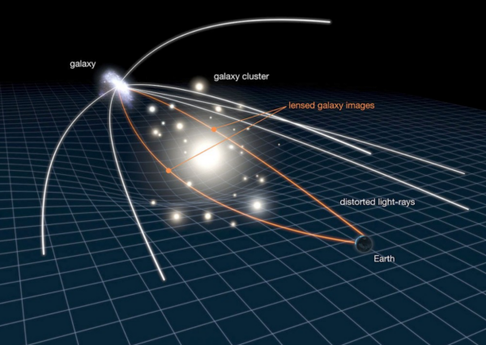]

## Case 2: Dark matter substructure from gravitational lensing

---

background-image: url(./figures/gl1.png)
class: center, middle, black-slide

---

class: middle, center

.center.width-100[]

---

background-image: url(./figures/stellar.jpeg)
background-position: left
class: black-slide

.smaller-x[ ]
## Case 3: Constraining dark matter with stellar streams

      
.pull-right[
  
<iframe width="360" height="270" src="https://www.youtube.com/embed/uQVv_Sfxx5E?&loop=1&start=0" frameborder="0" volume="0" allowfullscreen></iframe>

]

.footnote[Image credits: C. Bickel/Science; [D. Erkal](https://t.co/U6KPgLBdpz?amp=1).].]

---

class: middle, center

.center.width-100[]

.grid[
.kol-1-3[
   
.width-100[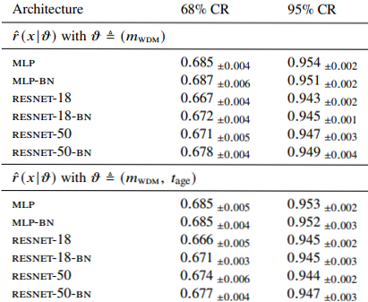]
]
.kol-1-3[
.width-100[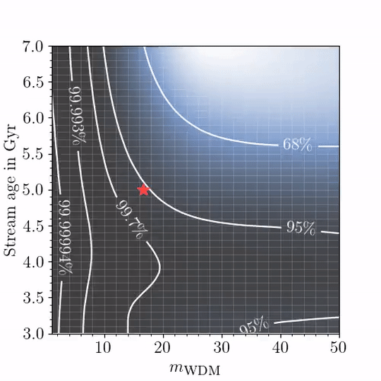]
]
.kol-1-3[
.width-85[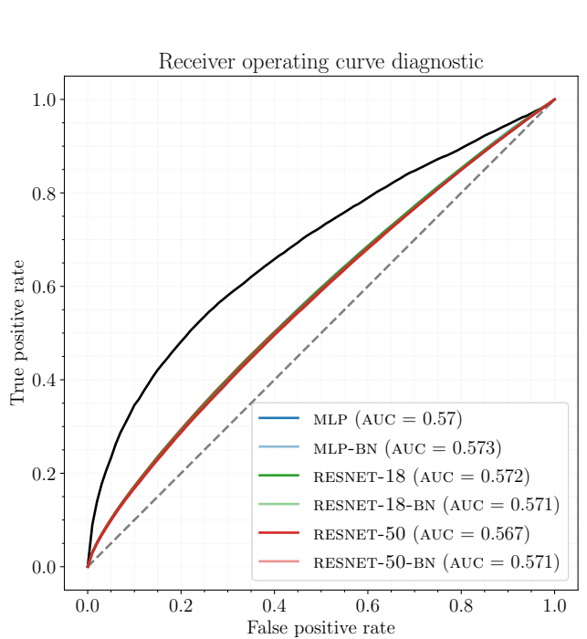]
]
]
.grid[
.kol-1-3[
## Coverage 
]
.kol-1-3[
## &nbsp;&nbsp; Convergence to $\theta^\*$
]
.kol-1-3[
## &nbsp;&nbsp;&nbsp;&nbsp;&nbsp; ROC AUC score
]
]

---

class: middle, center

.center[
.width-45[]
.width-45[]
]

Preliminary results for GD-1 suggest a **preference for CDM over WDM**.

---

class: middle, black-slide

## Case 4: Robotic grasping

.grid[
.kol-2-5[
.width-100[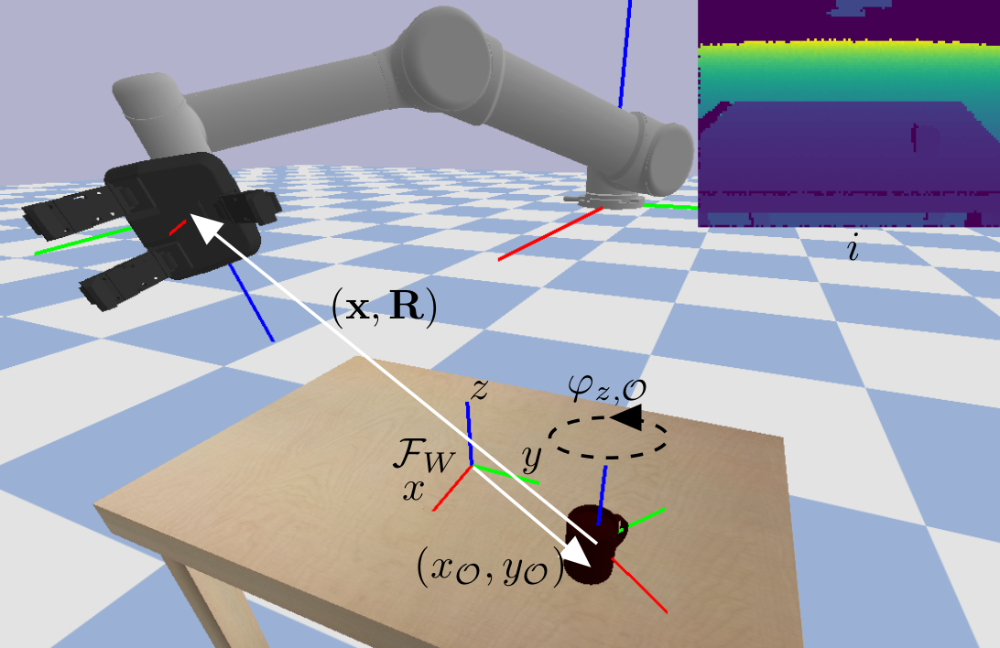]

.width-100[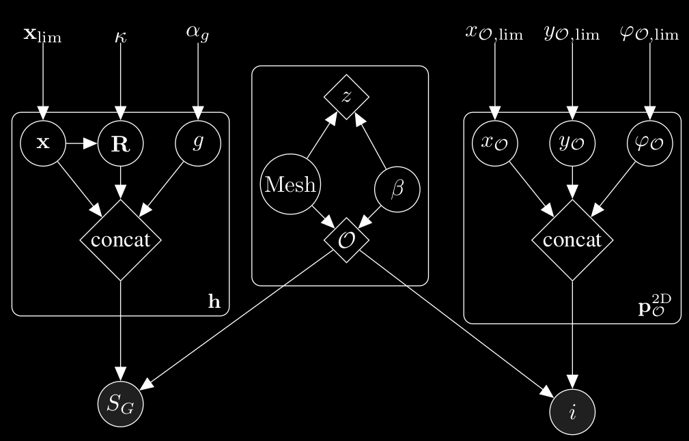]
]
.kol-3-5.center[<iframe width="480" height="360" src="https://www.youtube.com/embed/-VWclv-xqGE?&loop=1&start=0" frameborder="0" volume="0" allowfullscreen></iframe>]
]

---

class: middle
count: false

# The frontier

---

class: middle

.center.width-100[]

---

class: middle

.center.width-100[]

---

class: middle

.center.width-100[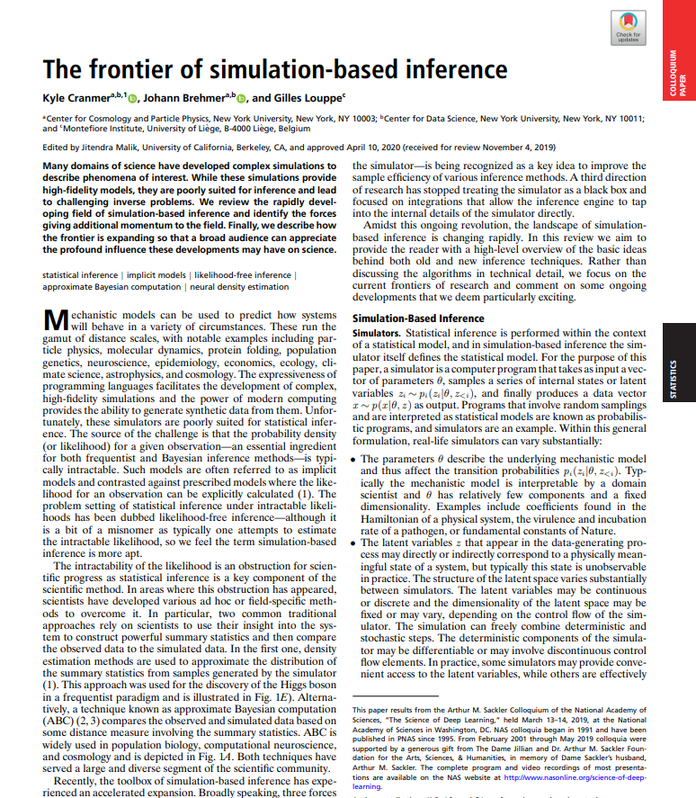]

---

# In summary

- Much of modern science is based on simulators making precise predictions, but in which inference is challenging.
- Machine learning enables powerful inference methods.
- They work in problems from the smallest to the largest scales.
- Further advances in machine learning will translate into scientific progress.

---

count: false

# Thanks!

 

.center[
.circle.width-20[]
.circle.width-20[]
.circle.width-20[]
.circle.width-20[]
]

.center[
.circle.width-20[]
.circle.width-20[]
.circle.width-20[]
.circle.width-20[]
]

---

count: false

# References

.smaller-xx[
- Hermans, J., Banik, N., Weniger, C., Bertone, G., & Louppe, G. (2020). Towards constraining warm dark matter with stellar streams through neural simulation-based inference. arXiv preprint arXiv:2011.14923.
- Cranmer, K., Brehmer, J., & Louppe, G. (2020). The frontier of simulation-based inference. Proceedings of the National Academy of Sciences, 117(48), 30055-30062.
- Brehmer, J., Mishra-Sharma, S., Hermans, J., Louppe, G., Cranmer, K. (2019). Mining for Dark Matter Substructure: Inferring subhalo population properties from strong lenses with machine learning. arXiv preprint arXiv 1909.02005.
- Hermans, J., Begy, V., & Louppe, G. (2019). Likelihood-free MCMC with Approximate Likelihood Ratios. arXiv preprint arXiv:1903.04057.
- Brehmer, J., Louppe, G., Pavez, J., & Cranmer, K. (2018). Mining gold from implicit models to improve likelihood-free inference. arXiv preprint arXiv:1805.12244.
- Brehmer, J., Cranmer, K., Louppe, G., & Pavez, J. (2018). Constraining Effective Field Theories with Machine Learning. arXiv preprint arXiv:1805.00013.
- Brehmer, J., Cranmer, K., Louppe, G., & Pavez, J. (2018). A Guide to Constraining Effective Field Theories with Machine Learning. arXiv preprint arXiv:1805.00020.
- Cranmer, K., Pavez, J., & Louppe, G. (2015). Approximating likelihood ratios with calibrated discriminative classifiers. arXiv preprint arXiv:1506.02169.
]

---

class: end-slide, center
count: false

The end.
